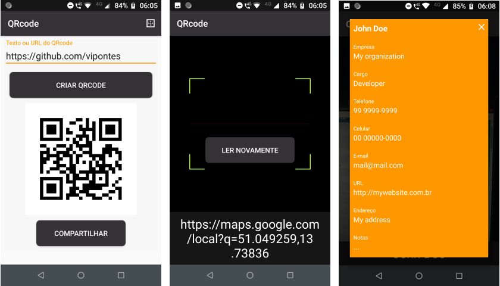

# QrCode (Gerador de QRCodes)

QrCode é um app que possibilita a criação de QRcodes e compartilhamento dos mesmo em formato .jpg.

Outra funcionalidade presente no app é a leitura e interpretação de QrCodes.

## Licença de uso

[MIT](https://choosealicense.com/licenses/mit/)